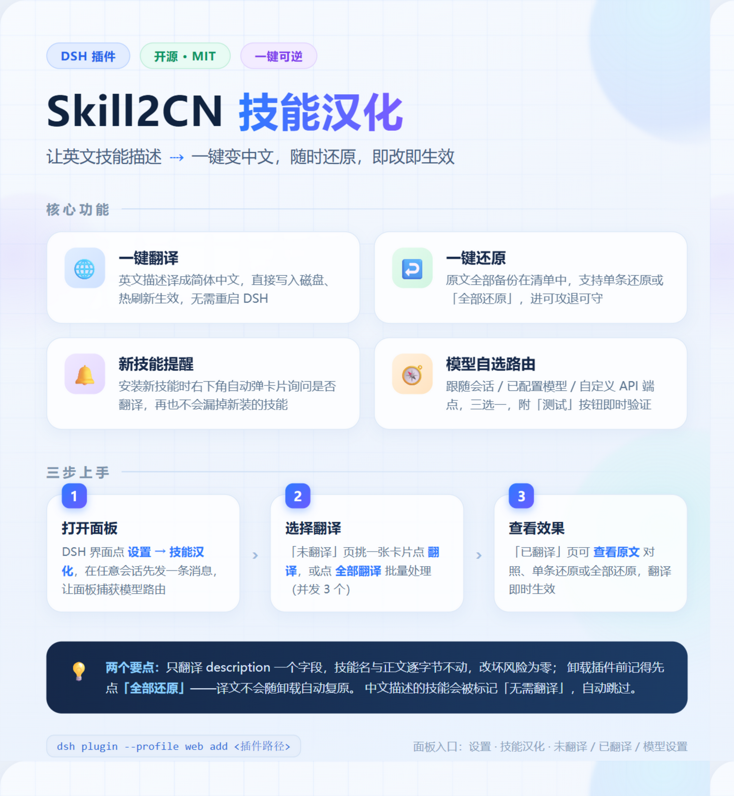

# Skill2CN · 技能汉化（`dsh-plugin-skill2cn`）

[English](README.md) | **简体中文**

把 DSH skill 的英文 `description` 翻译成简体中文，可一键还原。

- **唯一入口**：DSH 设置界面「技能汉化」分区页（3 个标签页：未翻译 / 已翻译 / 模型设置）；外加新增 skill 时的右下角提示浮层
- **翻译粒度**：只改 `SKILL.md` frontmatter 的 `description` 值；`name` 与正文逐字节不动
- **写盘改写**：译文直接写入磁盘上的 `SKILL.md`（架构决策见 `docs/adr/0001-write-to-disk-translation.md`），改完由 DSH 热刷新自动生效，**无需重启**
- **状态唯一事实源**：备份清单 `manifest.json`；面板按「磁盘 ↔ 清单」对账决定「未翻译 / 已翻译 / 无需翻译 / 已过期」

<p align="center">
  
</p>

## 演示视频

https://github.com/user-attachments/assets/a98d7649-052b-4912-8ff5-1a472abf2dda

介绍视频与上方使用说明海报（[源文件 HTML](docs/assets/poster.html)）由队友阿根制作；视频文件同时保留在仓库 [`docs/assets/introduction-video.mp4`](docs/assets/introduction-video.mp4) 中。

## 安装

```bash
dsh plugin --profile <profile> add <本仓库路径或 tarball>
```

`link:` 安装（本地路径）不跑 `prepare`，无需 `allowBuilds`。安装后重启一次 DSH（首次加载 host 半身），此后：

- 改 **host**（`src/service.ts`、`src/core/**`）→ `pnpm build` 后重启 DSH
- 改 **client**（`src/client/**`）→ `pnpm build` 后刷新浏览器

## 卸载

**先**在「已翻译」页点「全部还原」。写盘改写不会随卸载自动复原（ADR-0001 Consequences）。

```bash
dsh plugin --profile <profile> remove dsh-plugin-skill2cn
```

清单文件 `$DSH_HOME/skill2cn/manifest.json` 会残留（无害，可手删）。

## 开发

```bash
pnpm install
pnpm dev          # tsdown watch（先 tsc 转译标准装饰器到 lib-tsc，再打包）
pnpm test         # core 单测（vitest）
pnpm typecheck    # host + client 两套 tsconfig
pnpm build        # 产出 lib/index.js（host ESM）+ lib/client.js（closure-factory CJS）
```

### 构建管线说明

`@Remote` 装饰器需要 TypeScript 的标准装饰器转译，esbuild/tsdown 不处理，因此 `build` 分两步：
`tsc -p tsconfig.build.json` 产出 `lib-tsc/`，再由 tsdown 以 `lib-tsc/index.js` 为入口打包成 `lib/index.js`。
`lib-tsc/` 是中间产物（已在 `.gitignore` 中），由 `pnpm build` 自动重新生成。

## 新 skill 提示（浮层卡片）

新增 skill 落盘后，界面右下角弹出一张卡片问「要不要翻译」，只列**没被问过、没有译文、描述不是中文**的 skill（[翻译] [忽略]）。

- **首次运行会把存量一起问一次**（面板里那批未翻译的），处理过就永久不再提示。
- 「翻译」只翻卡片里这一批（并发 3，进度就地显示）；「忽略」把名字记入 `prompted.json`，之后不再问，但该 skill 仍留在面板「未翻译」页随时可手动翻。
- 判定与节流都在宿主侧；浏览器每 5 秒轮询一个只读内存的接口（目录没变时**零读盘**），页面隐藏时不轮询。
- 换到另一个工作区时，那个项目里未处理过的未翻译 skill 会再问一次（同一规则的一致行为）。

**已知依赖（DSH 升级需复核）**：靠 registry 的 `skills/change` 事件（无载荷、无过滤）触发重算，靠 `skill-filesystem` 的 chokidar watcher 发现文件新增；`skills/change` 在 DSH 全库目前没有消费者，是事实上的无主扩展点。若语义变化，症状是「不再提示」而不是报错。

不想被提示：把卡片点「忽略」即可（或删 `$DSH_HOME/skill2cn/prompted.json` 让所有 skill 重新变成「没问过」）。

## 数据与配置

| 内容 | 位置 |
|---|---|
| 备份清单（已翻译状态唯一事实源） | `$DSH_HOME/skill2cn/manifest.json` |
| 翻译路由配置 | `ctx.settings` 命名空间 `skill2cn`（`~/.dsh/settings.yaml`） |
| 自定义端点 API key | 同上，字段标记 `.role('secret')` → 视图脱敏，不回传明文 |

### 翻译路由（「模型设置」标签页）

1. **跟随 DSH 当前会话路由**（默认）：取最近一次会话请求的 provider/model。尚未捕获到路由时「测试」会提示先发一条会话消息。
2. **使用已配置的 provider/model**：下拉来自 `ctx.remote.llm.listConfigurableProviders()`；「发现模型」按 provider 的 `settingsNs` 调 `discoverModels`（部分 provider 未注册发现能力，此时可手工输入 model 名）。
3. **自定义端点**：在「高级」里选**协议**（`OpenAI 兼容` / `Anthropic 兼容`），再填 Base URL / API key / model 名。两者都是非流式：
   - OpenAI 兼容 → `POST {baseURL}/chat/completions`（`Authorization: Bearer`）
   - Anthropic 兼容 → `POST {baseURL}/messages`（同时带 `x-api-key` 与 `Authorization: Bearer`，官方与中转都能过；`anthropic-version: 2023-06-01`，`max_tokens` 必填）

   **Base URL 请填到版本段**（如 `https://api.deepseek.com/v1` 或 `https://api.anthropic.com/v1`），资源路径由插件追加。注意这与 DSH 里写 `anthropic` provider 的写法不同——那边 base 不含 `/v1`（它把路径交给 SDK），照那边填会 404。

「**测试**」按钮用当前路由跑一次真实小翻译，结果以**判决在前**的形式给出：绿色「配置成功」/ 红色「配置失败」，第二行才是明细（**译文 + 耗时 + 实际模型名**，失败时是宿主的原始原因）。试译例句固定在宿主里（`Use when translating skill descriptions into Simplified Chinese.`），刻意用本插件的自述句 —— 测试结果本身就说明「这套配置能翻好我要翻的东西」，句中的 `skill` 标识符还顺带验证内置 prompt 的「标识符不译」规则。

## 已知限制

- **工作区组取会话 workspace**（`session.header.cwd`；尚无会话事件时用 `ctx.sessions.list()` 里最近一个有 header 的会话兜底，都没有才退回进程 cwd）。所以「工作区」是你在 DSH 里打开的那个项目，而不是启动 DSH 的目录 —— 从 DSH 检出目录启动不会把检出自身的项目 skill 当成翻译目标。
- **枚举走 `ctx.skills` registry 胜者集合**：同名被覆盖的落选 skill、以及无磁盘文件的内存 provider skill 不进入面板。
- **「无需翻译」启发式**：CJK 表意字符 ≥ 4 且不少于拉丁字母数的一半。中文描述普遍夹带标识符与产品名（`dingtalk-*`、`Shadcn/ui`、`utility-first`、`spec`/`tickets`），按「多于」会误判成待翻译；反过来英文里冒出的几个中文词仍因比例不足判为可翻译。真实数据核验见验收记录。
- **「已配置路由」下拉列出的是 DSH 的 provider 目录，不等于本机注册了 adapter 的 provider**：选中未注册的 provider 时「测试」会报 `no adapter registered for provider "..."`（错误已如实透出）。
- 「插件包」来源的 skill 文件会在 npm 包升级/重装时被覆盖；卡片徽章带 ⚠️，覆盖后由打开面板时的自动对账兜底（静默清除记录或标「已过期」）。

## 验收

SPEC §7 九条的逐条实测记录见 [`docs/ACCEPTANCE.md`](docs/ACCEPTANCE.md)（含实现期发现的 DSH API 偏差与由此修复的缺陷）。

## 文档

- [`CONTEXT.md`](CONTEXT.md) — 术语表，插件全部概念的权威定义
- [`docs/SPEC.md`](docs/SPEC.md) — 产品规格与验收标准
- [`docs/adr/0001-write-to-disk-translation.md`](docs/adr/0001-write-to-disk-translation.md) — 架构决策：写盘改写
- [`docs/ACCEPTANCE.md`](docs/ACCEPTANCE.md) — 实施验收记录
- [`docs/README.md`](docs/README.md) — 文档导览

## License

[MIT](LICENSE)
